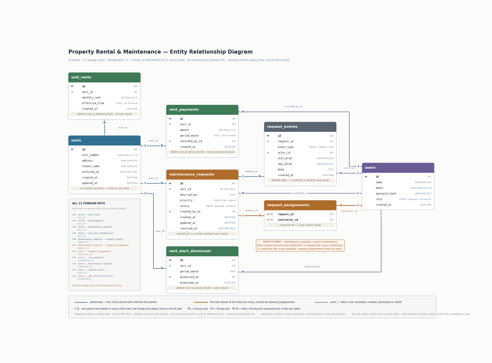

# Database Design

**Property Rental & Maintenance**

> **Status:** written at design time, before the tables existed, so the reasoning is recorded while it
> is being made rather than reconstructed at the end. Every column, type and constraint below matches
> `images/er-diagram.png` exactly.
>
> **All eight tables now exist**, created by one Alembic migration from the models in `api/app/models/`.
> The behaviour described in the derivation sections (§5.1, §5.2, §7, §8) is what the rent, alert and
> request code has to do; §13 marks which of its tests are written and which are still specification.

---

## 1. The design in one picture



Eight tables and **eleven foreign keys. Each foreign key is one one-to-many link.** Two of those
eleven — both on `request_assignments` — are the two halves of the system's single many-to-many.
`users` and `units` are the two roots: no column in either is a foreign key.
Everything else hangs off one of them, or off `maintenance_requests`, which is both a child and a
parent.

Most sensible designs for this problem end up looking similar, so the list of tables is not the
interesting part. What is worth explaining is the handful of places where the obvious design looks
fine, gives the wrong answer, and **gives no error while doing it**.

The clearest of those is **§4b**: rent looks like it should be a column on the unit, and that design
quietly re-prices the past every time a manager puts the rent up. **§5** has the other two — rent
status and alerts, both of which depend on today's date. **§9** lists every alternative I rejected and
the specific failure each one produces.

---

## 2. The requirements that actually constrain the model

Most of the brief is ordinary create-read-update-delete work and puts no pressure on the data model.
Six clauses do, and the whole design is shaped around them:

| Requirement | Pressure it puts on the data model |
|---|---|
| Rent is due monthly, with a grace period before it counts as overdue | "Overdue" is a function of **today's date**, not of any write |
| A dismissed alert **returns** if rent is still unmatched in a later month | Dismissal cannot be a property of a unit; it must be scoped to a month |
| Any number of contractors per request, any number of requests per contractor | A genuine many-to-many — the only one in the system |
| The timeline cannot be edited or deleted, *including by property managers* | Locking it down must not rely on a role check that someone could later loosen |
| Bulk rent classifies each row as matched / underpaid / overpaid | Exact money comparison — floats are disqualified |
| Archiving a unit must not destroy its history or its requests | Delete must be soft, and the foreign-key graph must stay intact |

---

## 3. The eight tables, and why each exists

| Table | Why it exists |
|---|---|
| `users` | Authentication and the two roles. A root of the graph |
| `units` | The portfolio. The other root |
| `unit_rents` | What a unit's rent is, and **from which month**. One row per rent change |
| `rent_payments` | A log of money received. One row per payment |
| `maintenance_requests` | The repair jobs. Both a child (of `units`, `users`) and a parent |
| `request_assignments` | The join table that makes the one many-to-many work |
| `request_events` | The timeline that cannot be edited |
| `rent_alert_dismissals` | Which alert a manager waved away, **and for which month** |

Two things a reviewer might look for and not find — a `rent_status` column on `units`, and an
`alerts` table — are missing on purpose, not by accident. Section 5 explains why.

---

## 4. Table by table: columns and types

Two rules apply everywhere.

**Money is `DECIMAL(10,2)`, never a float.** The bulk rent report has to decide whether the amount
received is *exactly* equal to the unit's monthly rent. Floats store numbers approximately, so 1234.10
can come back out as 1234.0999999999 and an equality check quietly fails. `DECIMAL` stores the exact
figure, so the comparison can be trusted.

**I store every timestamp in UTC** and convert it for display in the browser. That way a server in one
country and a reviewer in another never disagree about which day something happened.

### `users`

| Column | Type | Notes |
|---|---|---|
| `id` | `INT` AUTO_INCREMENT | PK |
| `name` | `VARCHAR(120)` NOT NULL | |
| `email` | `VARCHAR(255)` NOT NULL | UNIQUE — the login identifier |
| `password_hash` | `VARCHAR(255)` NOT NULL | bcrypt; the password itself is never stored |
| `role` | `ENUM('manager','contractor')` NOT NULL | the two roles |
| `created_at` | `DATETIME` NOT NULL | UTC |

### `units`

| Column | Type | Notes |
|---|---|---|
| `id` | `INT` AUTO_INCREMENT | PK |
| `unit_number` | `VARCHAR(32)` NOT NULL | UNIQUE — the identifier a manager types into a bulk rent batch |
| `address` | `VARCHAR(255)` NOT NULL | |
| `tenant_name` | `VARCHAR(120)` NOT NULL | a column, not a table — see §11 |
| `archived_at` | `DATETIME` NULL | NULL = active. Soft delete |
| `created_at` / `updated_at` | `DATETIME` NOT NULL | UTC |

**There is no `monthly_rent` column here.** The rent lives in `unit_rents`, one table down, and §4b
explains why.

`archived_at` is a soft delete instead of a real `DELETE`. Archiving must not destroy the unit's
payment history or its maintenance requests, and the foreign keys would refuse a hard delete anyway.
Restoring means setting the column back to `NULL`. The portfolio list filters `archived_at IS NULL` by
default.

Archiving also stops the rent clock. No rent is expected for the month a unit was archived in or any
month after it, so an archived unit does not quietly pile up overdue months for a flat nobody is
renting. §4b covers this.

### `unit_rents`

| Column | Type | Notes |
|---|---|---|
| `id` | `INT` AUTO_INCREMENT | PK |
| `unit_id` | `INT` NOT NULL | FK → `units.id` |
| `monthly_rent` | `DECIMAL(10,2)` NOT NULL | |
| `effective_from` | `DATE` NOT NULL | the 1st of the first month this rent applies to |
| `created_at` | `DATETIME` NOT NULL | |

UNIQUE `(unit_id, effective_from)` — a unit cannot have two different rents starting in the same
month. That constraint is itself the index the §4b lookup needs, so there is no separate index here: a
unique constraint on two columns *is* a B-tree index on those two columns, and adding a second one with
the same definition would cost a write every time and buy nothing.

`CHECK (monthly_rent >= 0)`. Zero is allowed — a staff flat or a rent-free period is a real thing — but
a negative rent is not.

I write one row when the unit is created, and another every time a manager changes the
rent for a *new* month. Correcting a figure for a month that already has a row edits that row
instead, so a unit never ends up with two rents starting in the same month — the unique
constraint would refuse it anyway. What is protected is every month *before* the one being
corrected: those keep the rate they had, which is the whole point of §4b.

### `rent_payments`

| Column | Type | Notes |
|---|---|---|
| `id` | `INT` AUTO_INCREMENT | PK |
| `unit_id` | `INT` NOT NULL | FK → `units.id` |
| `amount` | `DECIMAL(10,2)` NOT NULL | |
| `period_month` | `DATE` NOT NULL | always the 1st of the month it covers |
| `recorded_by_id` | `INT` NOT NULL | FK → `users.id` |
| `created_at` | `DATETIME` NOT NULL | when it was entered — deliberately *not* the same as `period_month` |

Index on `(unit_id, period_month)`, because every rent question this app asks is "what did this unit
pay for this month."

`CHECK (amount > 0)`. A zero payment is not a payment, and a negative one would be a refund, which this
system does not model — if a refund is ever needed it should be its own row type with its own name, not
a payment that quietly subtracts.

The two dates are the point of the table. When money arrived and which month it pays for are
different facts: July's rent can be recorded in September. I pin `period_month` to the 1st so
"which month" is an exact date match rather than a range query, and behaves identically on MySQL and
Postgres.

### `maintenance_requests`

| Column | Type | Notes |
|---|---|---|
| `id` | `INT` AUTO_INCREMENT | PK |
| `unit_id` | `INT` **NOT NULL** | FK → `units.id`. The NOT NULL *is* "belongs to exactly one unit" |
| `description` | `TEXT` NOT NULL | searched by the text filter |
| `priority` | `ENUM('low','medium','high','urgent')` NOT NULL | default `medium` |
| `status` | `ENUM('reported','triaged','scheduled','resolved')` NOT NULL | default `reported` |
| `created_by_id` | `INT` NOT NULL | FK → `users.id`; either role may create |
| `created_at` / `updated_at` | `DATETIME` NOT NULL | |
| `resolved_at` | `DATETIME` NULL | NULL means not currently resolved. The one copied value — see §8 |

Indexes on `unit_id`, `status`, `priority`, and `resolved_at` — one for each of the four filters
requirement 6 asks for, with the contractor filter served by `request_assignments` instead. The
`resolved_at` index answers "how many are open right now"; I build the dashboard's eight-week chart
from `request_events` instead, for the reason in §8.

### `request_assignments`

| Column | Type | Notes |
|---|---|---|
| `request_id` | `INT` NOT NULL | FK → `maintenance_requests.id` |
| `contractor_id` | `INT` NOT NULL | FK → `users.id` |

Primary key is the **pair** `(request_id, contractor_id)`; secondary index on `contractor_id` for a
contractor's cross-unit list. There is no separate `id` column, because the pair of IDs already
identifies the row on its own. Making that pair the primary key is what stops the same contractor being
assigned to the same request twice — the database rejects the duplicate.

### `request_events`

| Column | Type | Notes |
|---|---|---|
| `id` | `INT` AUTO_INCREMENT | PK |
| `request_id` | `INT` NOT NULL | FK → `maintenance_requests.id` |
| `event_type` | `ENUM('created','status_changed','assigned','unassigned','note')` NOT NULL | |
| `actor_id` | `INT` NOT NULL | FK → `users.id` — who did it |
| `old_value` | `VARCHAR(120)` NULL | previous status, or the contractor removed |
| `new_value` | `VARCHAR(120)` NULL | new status, or the contractor added |
| `body` | `TEXT` NULL | the text of a note |
| `created_at` | `DATETIME` NOT NULL | |

Indexes on `(request_id, created_at)`, because the timeline is always read in order for one request,
and on `(event_type, created_at)` for the dashboard's eight-week chart, which counts `status_changed`
rows in a date range.

`VARCHAR(120)` and not something shorter, because these columns hold contractor names as well as
status words, and `users.name` is `VARCHAR(120)`. A narrower column here would silently truncate the
longest names on assign and unassign events.

`old_value` / `new_value` are deliberately `VARCHAR` rather than the status ENUM, because the same
two columns also carry contractor names on assign and unassign events. One event shape for all five
kinds beats five near-identical tables and a five-way union to read one timeline.

### `rent_alert_dismissals`

| Column | Type | Notes |
|---|---|---|
| `id` | `INT` AUTO_INCREMENT | PK |
| `unit_id` | `INT` NOT NULL | FK → `units.id` |
| `period_month` | `DATE` NOT NULL | the month being dismissed, 1st of month |
| `dismissed_by` | `INT` NOT NULL | FK → `users.id` |
| `dismissed_at` | `DATETIME` NOT NULL | |

**UNIQUE `(unit_id, period_month)`.** That one constraint is what makes the hardest rule in the brief
work — see §5.2.

---

## 4b. Why rent is a separate table, not a column

This is the one place where the obvious design has a bug I only found by walking a scenario, so it is
worth spelling out.

**The obvious design.** Put `monthly_rent` on `units`. Reading it is one column lookup, and the brief
does say a unit has "a monthly rent amount". I had it this way at first.

**How it breaks.** The brief also says managers can edit units later. So:

- Unit 4B rents at 1000. The tenant pays 1000 for July and 1000 for August. Both months are matched.
- On 1 September the manager raises the rent to 1200.
- I work rent status out fresh every time it is asked for (§5.1), so the next time anyone opens the
  rent roll, July and August are compared against **1200**.
- Both months flip from matched to partial, and both raise an overdue alert.

The tenant paid in full, on time, and the system now says they owe 400. That is precisely the failure
the brief's scenario describes: "a tenant who has actually paid gets a late notice."

**The fix.** A unit does not have *a* rent. It has a rent *from a date*. So rent is a small list:

| unit_id | monthly_rent | effective_from |
|---|---|---|
| 7 | 1000.00 | 2026-01-01 |
| 7 | 1200.00 | 2026-09-01 |

Read it as: "from January, 4B costs 1000; from September, 1200."

Then `expected_rent(unit, month)` picks the row with the **latest `effective_from` that is not after
that month**. July asks and gets 1000. September asks and gets 1200. Changing the rent today cannot
reach backwards and change what was owed in July, because it adds a row instead of overwriting one.

**Two more rules live in the same function**, and both exist for the same reason — to stop the system
inventing debt that nobody owes:

- **Before the unit existed:** no rent is expected for any month before the earliest `effective_from`.
  Without this, adding a unit today would immediately produce a year of overdue months.
- **After the unit was archived:** no rent is expected for the month in `units.archived_at` or any
  month after it. Without this, a flat taken off the portfolio keeps generating a fresh overdue alert
  every month, for ever.

**The cost.** Reading a unit's current rent is now a lookup instead of a column, so the portfolio list
and the rent roll both join to `unit_rents`. That is the price of not being able to corrupt history,
and it is worth paying.

---

## 5. The three decisions that shape everything else

### 5.1 Anything that depends on today's date is computed, never stored

**Chosen.** I store two things: what the rent was (`unit_rents`) and what was paid
(`rent_payments`). I do not store the *status* of a month at all. I work it out each time someone
asks, from three things — what the rent was that month, the total paid for that month, and today's
date — in one place, `services/rent.py`:

```
paid = SUM(amount) WHERE unit_id = U AND period_month = M      -- 0 if no rows
due  = expected_rent(U, M)                                     -- 0 if no rent is owed

not_due  : due == 0
unpaid   : due > 0  AND  paid == 0
partial  : due > 0  AND  0 < paid < due
matched  : due > 0  AND  paid == due
overpaid : due > 0  AND  paid >  due

overdue  : (unpaid OR partial) AND today >= (M + GRACE_PERIOD_DAYS)
```

**`not_due` is doing real work, and leaving it out was a bug.** `due` is zero for any month before the
unit's first rent and for the month it was archived onward (§4b). Without this first line, those months
have `paid == 0` and would come out as `unpaid`, then `overdue` — which is exactly the invented debt
§4b exists to prevent. A `not_due` month never appears in the alerts list and shows as a dash in the
rent roll rather than as a status.

The five states are exclusive: a month is exactly one of them. `overdue` is separate and sits on top of
`unpaid` or `partial` once the grace period has passed.

**On the two words that come straight from the brief.** `matched` means the amount received **equals**
the rent, which is why `overpaid` is a state of its own rather than being folded into `matched` —
requirement 7 asks for the two to be told apart. And requirement 10 says the alert fires unless rent
"has not been matched by a **full** payment", so a `partial` month raises an alert just like an
`unpaid` one.

**`GRACE_PERIOD_DAYS` is 5**, set in `config.py` and read from the environment. Requirement 2 asks for
"a short grace period before an unpaid month counts as overdue" without naming a number, so five days
is my choice, not the brief's: long enough to cover a weekend and a slow bank transfer, short enough
that a manager still finds out within the first week. It is one setting for every unit — §11.

**The boundary is `>=`, and I changed it from `>` while writing the code.** Five days of grace means
the 1st to the 5th are the grace days and the 6th is the first overdue day. Written as `>` it would
have been the 7th — six days of grace for a setting that says five. Nothing would have errored; the
alert would simply have arrived a day late for ever, which is the kind of off-by-one that survives a
whole project because it never looks wrong. `test_grace_period_boundary` now pins all three days.

**One vocabulary note, because the brief uses two words for one idea.** The state above is called
`partial`. The bulk rent report calls the same situation **underpaid**, because that is requirement 7's
word. They are the same thing: money received, but less than was owed. The report also has a fourth
outcome, `unmatched`, which is not a rent state at all — it means the unit number in the pasted batch
does not exist.

**What the bulk report actually compares, which is not the same question as above.** Requirement 7 says
each row is classified by whether "the amount received equals that unit's monthly rent". So the report
compares **that row's amount** against the rent for that month — not the month's running total.

The difference shows up in one case, and it is worth knowing before someone reports it as a bug. A unit
owing 1200 pays 600 in one batch and 600 in another. Both rows come back as *underpaid*, because
neither amount equals 1200. The month itself is nonetheless *matched*, and the rent roll and the alerts
both say so, because those add the payments up.

The two answers are different because they answer different questions: the report says what happened to
each line you pasted, and the rent roll says where the unit stands. Both are correct, and the report's
wording says which row it is talking about so the two are not confused.

**Rejected.** A `units.rent_status` column maintained on write.

**Where the rejected version breaks.** A unit is fully paid on 3 September. On 6 October it is
overdue — and **no write happened**. Nobody clicked anything; the grace period simply elapsed.
Keeping a stored column truthful therefore requires a nightly job whose only purpose is to flip
statuses at midnight: a second moving part, and one that can silently stop on a free tier that
sleeps.

It fails a second way that has nothing to do with time. A manager records in October a bank transfer
that actually covered August. With a stored column you must locate and recompute August, and unwind
an alert already raised against it. With derivation, the August question simply returns a different
answer the next time it is asked.

And a third way, which is really about shape. Rent status is not a fact about a *unit*. It is a fact
about a *unit and a month*. Unit 4B can be paid up for September and unpaid for July at the same time.
One column can only hold one answer, so it has to throw away the per-month history that the rent roll
and the dashboard both report on.

**The cost:** every read runs a small SUM query instead of reading one column. §12 works out what
that costs at scale.

### 5.2 A dismissal is a fact about one month, not a flag on a unit

**Chosen.** `rent_alert_dismissals(unit_id, period_month)` with `UNIQUE (unit_id, period_month)`.
I do not store alerts at all. I work them out on the spot, as every *(unit, month)* pair where:

```
the unit is not archived        (units.archived_at IS NULL)
AND the month is overdue        (§5.1: unpaid or partial, and past the grace period)
AND the month is within the last 12
AND there is no dismissal row for that exact (unit, month) pair
```

The badge in the navigation is a `COUNT` over that same set, so the number and the list can never
disagree.

**Rejected.** A `units.alert_dismissed` true/false column, and the less obviously broken version,
`units.alert_dismissed_at`, which stores when it was dismissed.

**Where the rejected versions break.**

*The boolean.* 9 August: unit 4B has not paid, grace has passed, the alert appears. The manager knows
the tenant is travelling and dismisses it — flag set true. 6 September: 4B still has not paid, for
August *or* September, and the flag is **still true**, so no alert appears. The requirement is
violated, and violated silently — nothing errors, the alert just never comes back. Patching it with a
job that clears every flag on the 1st reintroduces the cron dependency *and* wipes a dismissal made
yesterday for an unrelated reason.

*The timestamp.* It breaks at the month boundary. A manager dismisses September's alert at 23:00 on 30
September. An hour later it is October, "the start of the current month" is now midnight on the 1st,
and 23:00 on the 30th is *older* than that — so the alert is back. The dismissal lasted an hour. The
same click made on 1 October would have held for the whole month. Same action, different result,
decided by nothing but the time of day it happened.

One timestamp also cannot say *which* month was dismissed. A unit behind on July, August and September
has all three alerts hidden by one click.

**Why this is the better design, not just a working one.** Say unit 4B is `unit_id` 7. Then
`(7, 2026-09-01)` and `(7, 2026-10-01)` are simply two different keys. September's dismissal row does
not match October's alert, so October's alert appears on its own. The alert comes back because the key
changed — not because any code remembered to run. There is no scheduled job, no monthly reset, and no
code anywhere in the system that knows months roll over.

The `UNIQUE` constraint also means clicking dismiss twice cannot create two rows: the second insert is
rejected, so the action is safe to repeat.

It also generalises without further work. A unit unpaid for July, August and September produces three
independent alerts and a badge of three; dismissing September leaves July and August visible. The
requirement was written about one month returning the next, and arbitrary arrears fall out of the
same key.

### 5.3 The timeline has no edit or delete endpoint at all

**Chosen.** Rows are only ever added to `request_events`. That is guaranteed by there being **no route
in the API that updates or deletes an event** — not for contractors, and not for managers either.

**Rejected.** An edit and delete endpoint with a role check on it. Also a database trigger that blocks
UPDATE and DELETE.

**Why.** The requirement says the timeline cannot be edited "including by property managers."

A role check is a line of code that someone can loosen later without meaning to. A feature that was
never built cannot be loosened, skipped, or misconfigured. Nothing to get wrong is stronger than
something to get right.

A database trigger would be stronger still, and I did not use one for a specific reason: trigger syntax
differs between MySQL and Postgres, which breaks the portability rule in §10, and at this size it would
not buy anything the missing endpoint does not already buy. That is a fair thing to push back on.

**One more rule matters just as much.** When a request changes, the change and its timeline row are
saved **in the same transaction** — both or neither. If they could be saved separately, a crash in
between would leave a status change with nobody's name on it. A history that is quietly wrong is worse
than no history at all, because it still looks trustworthy.

---

## 6. The relationship model

**Eleven foreign keys. Every one of them is a one-to-many link**, and the foreign key always sits on
the "many" side. Two of the eleven — both on `request_assignments` — are also the two halves of the
system's one and only many-to-many.

It is worth putting it that way, because "how many relationships are there" depends on how you count
them. Counting foreign keys is unambiguous: there are eleven, they are all listed below, and the ER
diagram draws all eleven. Rows 6 and 7 are the pair that together make the many-to-many.

| Parent (1) | Child (N) | Foreign key |
|---|---|---|
| `units` | `unit_rents` | `unit_id` |
| `units` | `rent_payments` | `unit_id` |
| `units` | `maintenance_requests` | `unit_id` |
| `units` | `rent_alert_dismissals` | `unit_id` |
| `maintenance_requests` | `request_events` | `request_id` |
| `maintenance_requests` | `request_assignments` | `request_id` |
| `users` | `request_assignments` | `contractor_id` |
| `users` | `rent_payments` | `recorded_by_id` |
| `users` | `maintenance_requests` | `created_by_id` |
| `users` | `request_events` | `actor_id` |
| `users` | `rent_alert_dismissals` | `dismissed_by` |

**The many-to-many is rows 6 and 7 seen from either end:** `maintenance_requests ↔ users`
(contractors). A request can have many contractors; a contractor can be on many requests.

A single `contractor_id` column on the request cannot express it — that permits one contractor per
job, so a plumber and an electrician cannot both attend. A comma-separated `contractor_ids` text
column is worse: "what is contractor 9 working on?" becomes a full scan with string splitting, and
nothing constrains the values to real users. `request_assignments` holds one row per pair, with the
**pair itself as the primary key**, which makes a duplicate assignment impossible at the database
level rather than by a check someone has to remember to write. Assigning is inserting a row;
unassigning is deleting it.

The last four rows are there so every action has a name against it: who recorded the payment, who
raised the request, who acted on it, who dismissed the alert. They are ordinary one-to-many links like
all the others, with the foreign key on the "many" side.

`maintenance_requests.unit_id` is `NOT NULL` because "every request belongs to exactly one unit" is a
structural truth, not a policy. I put it in the database so it holds regardless of what code
runs.

---

## 7. Where constraints live, and why the line is there

**The rule: the database enforces what must be true no matter what code runs; the application
enforces what needs to explain itself when it says no.**

**Database** — every foreign key; `maintenance_requests.unit_id NOT NULL`; `UNIQUE` on `users.email`
and `units.unit_number`; `UNIQUE (unit_id, period_month)` on dismissals; `UNIQUE (unit_id,
effective_from)` on rents; the composite primary key on `request_assignments`; and two `CHECK`
constraints on money — `rent_payments.amount > 0` and `unit_rents.monthly_rent >= 0`.

The money checks are worth calling out, because this is a system about money and it would be easy to
leave them out. Nothing in the application is supposed to write a negative payment, but "supposed to"
is not a guarantee — a bad import, a typo in a bulk paste, or a future endpoint could do it, and a
negative payment would silently reduce what a unit appears to owe. That is the class of bug that only
surfaces as an angry tenant. `CHECK` is supported on MySQL 8 and on Postgres, so it costs nothing in
portability.

**Application** (`api/app/services/`) — the maintenance lifecycle and its one guarded edge; role
permissions; the bulk rent classification; and normalising dates to the 1st of the month.

**Where `period_month` and `effective_from` get pinned to the 1st.** In the application, on the way in
— one helper that every write path calls, so a caller cannot forget. Every rent query depends on those
columns being exactly the 1st, because "which month" is written as an `=` match rather than a range.

This is the weakest spot in the whole constraint story, and it is worth being straight about: the rule
is important enough to belong in the database, and it is not there. It *could* be —
`CHECK (EXTRACT(DAY FROM period_month) = 1)` works on both MySQL 8 and Postgres. I left it in the
application because it needs a clear error message when a caller gets it wrong, and because the
application is the only writer today. If anything else ever writes to this database, that `CHECK` is
the first thing I would add.

**Why not push the lifecycle into a `CHECK` constraint?** Because the requirement is not merely that
an illegal transition fails — it is that the server rejects it *"with a message explaining why."* A
constraint violation can only say *constraint violated*. It cannot say **"cannot move to Scheduled:
no contractor is assigned yet."** The rule and its explanation have to be the same piece of code, so
the rule lives where a sentence can be attached to it.

The transition table is stated explicitly rather than scattered through conditionals:

```
reported  → triaged
triaged   → scheduled    guard: ≥ 1 row in request_assignments, else 409
scheduled → resolved     sets resolved_at
resolved  → triaged      reopen — to Triaged, NOT to Reported; clears resolved_at
every other pair → 409, naming both states and the reason
```

`triaged → scheduled` is the only guarded move, and `resolved → triaged` is the only backwards one.
Both are spelled out in the brief, so both get a test named after them.

**One extra rule, because the guard has a hole without it.** The brief says a request cannot *move
into* Scheduled with no contractor assigned. Guarding only the move is not enough:

- Request 18 is Triaged. Ravi is assigned. The manager moves it to Scheduled — the guard passes.
- Ravi calls in sick, so the manager unassigns him.
- Nothing stopped that. Request 18 is now Scheduled with nobody assigned — exactly the state the
  guard exists to prevent, reached by going around it.

So removing the **last** contractor from a Scheduled request **moves that request back to Triaged**, in
the same transaction as the unassignment. The timeline gets two rows: the `unassigned` event, and a
`status_changed` from `scheduled` to `triaged`, both with the manager's name on them. The rule then
holds all the time — a Scheduled request always has at least one contractor — rather than being checked
at one door.

Triaged is the right landing place because it is the truth: the job has been assessed and nobody is
going. Nothing about the assessment is lost, which is the same reason the brief sends a reopened
request to Triaged rather than back to Reported.

**The alternative, and why not.** Refusing the unassignment outright would also keep the rule true, and
it has the advantage that no status changes behind the manager's back. I rejected it because
requirement 5 says a manager may remove an assignment, and a rule that makes a permitted action fail
is the worse trade — a contractor who goes sick could not be taken off the job without the manager
first moving the request by hand. The cost of the choice I made is real and worth stating: a status can
change as a side effect of an unassignment. The timeline is what stops that being a mystery.

The limit of putting rules in the application is worth naming: they only hold while the application is
the only thing writing to the database. That is exactly why the structural facts above are pushed down
into the database instead.

---

## 8. The one piece of copied data

Copying a value that could be worked out from somewhere else is called **denormalising**. It is
normally a mistake, because now there are two versions of the same fact and they can drift apart. We
do it in exactly one place, on purpose.

**`maintenance_requests.resolved_at`.** It could be worked out by searching `request_events` for the
last time this request changed to `resolved`. It is copied onto the request so that "when was this
resolved?" is available wherever a request is shown or filtered — the request list, the request detail
page, and "resolved between these dates" — without joining to the event table every time.

**Its original justification no longer holds, and I would rather say so than quietly keep it.** I first
copied this column for the dashboard's eight-week chart. That reason is gone: the chart reads
`request_events` instead, for the reason in the next paragraph. What is left is a narrower case — it
saves a join on the request list and the detail page — and that is a weaker argument than the one I
started with. I kept the column because those reads are frequent and the column is cheap, but it is a
closer call now than it was, and a reviewer would be right to push on it.

**What it means, exactly, and a trap I avoided.** `resolved_at` answers "is this request currently
resolved, and when did that happen?" It is not a history of every time it was ever resolved. When a
request is reopened it goes back to Triaged and `resolved_at` is set to NULL, both in the same
transaction as the event row.

That has a consequence worth catching before it bites:

- Request 40 is resolved on 4 August and counts towards that week's bar on the chart.
- On 20 August a manager reopens it. `resolved_at` becomes NULL.
- If the chart read `resolved_at`, the week of 4 August would quietly lose a bar it had already
  reported. The past would change because of something that happened in the present.

So **I build the eight-week chart from `request_events`, not from `resolved_at`** — counting the
`status_changed` rows into `resolved`, which never disappear. I use `resolved_at` for the "is it
open right now" questions, where the current answer is the one you want. Two questions, two sources,
each pointed at the one that can actually answer it.

**This is the only copied value in the schema.** An `assigned_at` column on `request_assignments` was
considered, to save a lookup when showing who was assigned when, and rejected on the same reasoning —
the timeline already records it. "One piece of copied data, and here is exactly why" is a much easier
position to defend than "a few places, for speed."

---

## 9. Rejected alternatives, and the failure each produces

| Alternative | Concrete failure |
|---|---|
| `units.monthly_rent` as a single column | **Reversed decision.** Raising the rent in September silently re-prices July and August, so a tenant who paid in full is chased for the difference. Now `unit_rents`, one row per rate change — see §4b |
| `units.rent_status` column | Unit paid 3 Sept is overdue 6 Oct with no write to trigger an update; needs a nightly job |
| `units.alert_dismissed` boolean | Dismiss August → September's alert never returns. Silent |
| `units.alert_dismissed_at` timestamp | Dismiss at 23:00 on 30 Sept and the alert is back an hour later; dismiss on the 1st and it hides the whole month |
| `contractor_id` on the request | One contractor per job; cannot send a plumber and an electrician |
| `contractor_ids` as CSV text | "What is contractor 9 on?" is a full scan; no referential integrity |
| Permission check on event edit/delete | A refactor can weaken it; the requirement says *including managers* |
| Hard `DELETE` on archive | Destroys history the requirement preserves; foreign keys would refuse it anyway |
| `FLOAT` for money | *matched* vs *underpaid* turns on exact equality |
| Rely on `ENUM` declaration order to sort | **Reversed decision.** Correct while the column really is an enum, but SQLAlchemy renders it as `VARCHAR` when there is no native enum type — on SQLite in tests, or with `native_enum=False` — and then it sorts *alphabetically*: `high, low, medium, urgent`. No error either way. Replaced by an explicit `case()` rank in the query, which does not care how the column was built — the ranks are in `app/models/enums.py`, the `ORDER BY` comes with the request list |
| Separate tables per event type | Five near-identical tables; one timeline query becomes five unions |
| `tenancy_start_date` + prorated first month | A second shape of "amount due" that every screen and the bulk import must understand, for a rule no requirement states — see §10 |
| Guard only the move into Scheduled | Assign, schedule, then unassign — and the request sits in Scheduled with nobody on it. The guard is stepped around, not broken. Removing the last contractor now drops the request to Triaged. See §7 |
| Chart the eight weeks from `resolved_at` | Reopening a request in August erases a bar from the week of 4 August. The chart reads `request_events` instead — see §8 |

Two rows in that table are mistakes I actually made and had to undo, not alternatives I dismissed on
paper.

The **ENUM ordering** one is the more embarrassing, because it would not have failed anywhere I was
looking. It was correct on MySQL and silently wrong wherever SQLAlchemy renders the column as
`VARCHAR` — SQLite, where every test runs — so no error and no failing test, just a wrong sort order.
(My first write-up of this said it was wrong on Postgres. That was itself wrong, and
`decisions.md` Decision 6 keeps the correction: a native Postgres enum sorts by declaration order.
Now that the app actually runs on Postgres I have checked rather than asserted it.)

The **single `monthly_rent` column** one is the more serious. It would have broken on the live system,
for real tenants, the first time anyone put the rent up. I found it by walking one specific scenario
end to end — pay July, pay August, raise the rent, reload the page — rather than by re-reading the
schema. That is the lesson from both: reading a design does not test it. Pick a story and follow it
through the tables.

---

## 10. Conventions, and the reasoning behind each

**Money is `DECIMAL(10,2)`, never a float.** Bulk rent classifies a row as *matched* when the amount
received **equals** the monthly rent.

**I store all timestamps in UTC**, formatted in the browser.

**`period_month` is a `DATE` pinned to the 1st.** Deliberately not the same fact as `created_at`.

**Payments are never auto-allocated to the oldest debt.** A tenant three months behind who pays one
month's rent does not have it quietly credited to July. The manager says which month it covers,
because the brief says a payment carries "the month it covers".

Crediting the oldest debt first is what most billing systems do. It also brings back the exact failure
this company is trying to escape: someone who has paid gets chased for the wrong month, because the
system decided on its own what their money was for.

**Rent is billed by whole calendar month.** No proration, no tenancy dates — a tenant moving in on
the 15th owes that month in full. Proration would require a tenancy model no requirement asks for, a
day-count convention to defend, and a second shape of "amount due" that every screen and the bulk
import would have to understand.

**One function decides what is owed, and only that function reads the rent.** `expected_rent(unit,
month)` is the only place that touches `unit_rents`. Four things ask it the same question — rent
status, the bulk classification, the alerts list, and the rent roll — and because they all go through
one function they cannot drift apart and start disagreeing about what a month cost.

The function has three rules, set out in full in §4b:

1. Use the rent that was in force **in that month**, not today's rent.
2. Nothing is owed for months **before the unit existed**.
3. Nothing is owed for the month the unit was **archived** in, or any month after it.

Rules 2 and 3 both exist to stop the system inventing debt: without 2, adding a unit today would raise
a year of overdue months for rent nobody owed; without 3, a flat taken off the portfolio would keep
raising a fresh alert every month for ever.

**Consecutive unpaid months need no special handling**, because rent status is a fact about a
*(unit, month)* pair rather than about a unit. A unit unpaid for July, August and September is three
independent overdue months: three alert rows, a badge counting three, and dismissing September leaves
July and August visible. It falls out of the same key that makes §5.2 work.

**No SQL that only works on one engine.** Every query goes through SQLAlchemy. This was insurance:
free MySQL hosting is harder to find than free Postgres, and if it fell through, switching should be
a `DATABASE_URL` change and one migration re-run instead of a rewrite.

**The insurance was claimed.** The app now runs on PostgreSQL 17, because the chosen host offers free
Postgres and not free MySQL — the exact scenario this rule was written for. The single migration ran
against an empty Postgres unchanged, all 286 tests passed untouched, and all 51 requirement clauses
passed over HTTP against the new engine.

What the rule did *not* cover is worth stating, because it is the honest limit of "portable SQL":
collation. MySQL compares strings case-insensitively by default and Postgres does not, so unique
indexes and equality both changed behaviour without a line of SQL changing. That cost nothing here
only because §10's other rule — decide engine-dependent behaviour in the application, not in the
engine — had already moved email and unit-number matching into Python. `decisions.md` Decision 5
records the full cost, and it also records the part portability says nothing about at all:
concurrency behaviour, which had to be re-proved by running it.

---

## 11. Known limitations, accepted deliberately

- **No tenancy dates, no proration, no lease terms.** A tenant moving in mid-month owes the full
  month.
- **A unit cannot be marked empty, and there is no clean workaround.** `tenant_name` is required, and
  rent is expected every month from the unit's first rate until the month it is archived. So a flat
  standing empty between tenants keeps raising overdue alerts for rent nobody owes.

  Archiving does not solve it. Archiving stops the rent clock (§4b rule 3), but that rule reads
  `units.archived_at`, and restoring the unit sets that column back to `NULL` — at which point every
  month of the gap becomes owed again, retrospectively. Archiving only helps for a unit leaving the
  portfolio for good.

  What a manager would actually do is **dismiss the alerts for the empty months**. That is a supported
  action, and it leaves a record of who dismissed what and when, which is better than a silent
  workaround. It is still a manual step for something the system should know.

  Doing it properly means vacancy periods with start and end dates — the same tenancy model ruled out
  above, and the honest reason it is not here is that no requirement asks for it and it is not free. If
  the tenant portal from the stretch list were ever built, this is the first thing that would have to
  change.
- **No `tenants` table.** The requirement asks for the tenant's *name* and nothing more — no tenant
  identity, history or login. If it is ever needed: add the table, copy the names across, and swap the
  column for a foreign key.
- **Alerts only look back 12 months.** Without a limit, a unit abandoned two years ago would produce
  24 alert rows and a badge number nobody can act on.
- **The grace period is one setting for everyone**, not per unit. No requirement asks for per-unit, and
  it is a one-line change to a column if one ever does.
- **Only maintenance requests keep a timeline**, not units or payments. That is what the requirement
  asks for. Doing it for everything would triple the number of places that write history, for a need
  nobody stated.
- **Nothing runs on a schedule.** This follows from §5.1 and is the main trade-off in the whole design.
  There is no timed job to break and no stored value to go stale, and the price is one "add up this
  unit's payments" query each time a page asks about rent.

---

## 12. What breaks first at 100x the data

100x the stated scale is roughly 4,000 units, ~48,000 payments per year, ~20,000 requests and
~120,000 events. None of that is large for Postgres. The first thing to degrade is not a table
size — it is one derived query.

**The alerts endpoint goes first.** Alerts derive over *(unit × month)* pairs, so unlike every other
query in the system they grow in **two dimensions at once**: 4,000 units across the 12-month window
is ~48,000 candidate pairs, evaluated every time the navigation badge renders. At the brief's scale it
is a few hundred pairs and invisible; at 100x it is the page everyone loads first.

**One correction to what I predicted here, because the code came out better than the plan.** I wrote
that each pair would need "a payment sum and a dismissal lookup", which describes ~96,000 round trips
and is the textbook N+1. That is not what got built: `rent_states` fetches the rate history and the
monthly totals in **two queries** for the whole grid and matches them up in Python, and the dismissals
are a third. `test_rent_states_is_two_queries_regardless_of_size` counts the statements so it stays
that way.

So the shape of the problem changed. It is no longer round trips; it is that the endpoint loads every
active unit and builds 48,000 objects in Python on each request. Still the first thing to degrade, and
still for the same underlying reason — two dimensions — but the fixes are now about volume rather than
chattiness:

1. **Narrow the window** below 12 months. Cheap, and almost certainly sufficient — nobody chases rent
   from three years ago through this screen.
2. **Push the filter into SQL**, so the database returns only the pairs that are actually overdue
   instead of the application classifying every pair to discard most of them. This is the real fix and
   it is the one I would do; the reason it is not done now is that the Python version is the same rule
   the rent roll and the bulk report use, and having one rule in one place is worth more at this scale
   than a query that is faster than it needs to be.
3. **Cache the badge count** per manager for 60 seconds; the number does not need to be
   transactional.
4. **Only then** a materialised `unit_month_rent_summary`, refreshed on payment insert —
   reintroducing the stored value deliberately, *with the ledger still the source of truth*, once
   there is a measured reason rather than a guess.

**Second is the text search on maintenance requests.** This is the one part of the request list that
no index can help. `description` is a `TEXT` column, and searching inside it means
`LIKE '%term%'`, which a normal index cannot serve — the database has to read every row. At a few
hundred requests that is invisible. At 20,000 it is a full table scan, and it runs twice, because the
`total` for pagination needs its own `COUNT` over the same condition. The fix on Postgres is a `tsvector` column
with a GIN index, or a trigram index (`pg_trgm`) if substring matching has to be kept exactly as it
is today. Either one is the place the portability rule in §10 finally has to bend, because full-text
syntax has no common form across engines — MySQL's answer would have been a `FULLTEXT` index and the
query would not have transferred.

**Third is the rent roll CSV.** It grows in one dimension rather than two, and it streams rows out as
it formats them rather than building the whole file in memory first, so at 100x it gets slow rather
than running out of memory. The one place it would still bite is that it loads every unit before it
starts streaming, so the first byte waits for the whole portfolio.

**And a new one that only exists now that requirement 7 is built: the bulk batch loads every unit.**
`services/bulk.py` reads the entire units table into a dictionary so that identifier matching happens
in Python rather than in SQL — which is deliberate, because the engines disagree about whether
`4b` equals `4B`: MySQL says yes, Postgres and SQLite say no (§10, and `decisions.md` (w)). At 4,000 units that dictionary is still small; the
honest ceiling is tens of thousands, after which the matching has to move into SQL with an explicit
collation, and the portability rule has to bend for it the same way the full-text index bends.

One detail about that search worth naming, because it is a correctness point rather than a speed
one: `%` and `_` are `LIKE` wildcards, so the search term is escaped before it goes into the pattern.
Without that, searching for `%` matches every row and searching for `50%` matches anything starting
"50". The value was always bound as a parameter, so this was never an injection — it was a wrong
answer, which is worse, because nothing errors and nobody notices.

The rest of the request list is fine. All four filters requirement 6 asks for go through an index —
`unit_id`, `status` and `priority` are indexed on the table, and filtering by contractor goes through
the primary key of `request_assignments`. Sorting happens in the database, and `total` comes from a
`COUNT` rather than from loading every row and counting them in Python.

---

## 13. How these claims will be verified

I write every rule above as a plain function that takes values and returns a value, so each one can
be tested on its own without going through HTTP.

The list below was written from the requirements before any code was written, so it is a
specification rather than a report. **Every item is now marked *(written)*: 286 tests pass in about
four seconds.** The wording of each item is the one from the original list, so it can be read against
what was promised rather than against what was convenient to build.

Lifecycle:

- All 16 status pairs: the four legal moves succeed, every other one returns 409 with a message
  *(written — parametrised, and the message must name both states)*.
- `triaged → scheduled` with nobody assigned is rejected; with one contractor assigned, it succeeds
  *(written)*.
- Reopening from `resolved` lands on **`triaged`**, not `reported` *(written)*, and clears
  `resolved_at` *(written)*.
- Unassigning the last contractor from a `scheduled` request drops it to `triaged` and writes both
  events *(written)*. Unassigning one of two leaves it `scheduled` *(written)*.

Rent:

- **Raise the rent, and past months keep their old price.** *(written)* Add a 1300 rate from
  September to a unit renting at 1200, then re-read July and August: both still 1200. This is the test
  that catches the bug in §4b, and it is the one I would want run first.
- A bulk batch with one row of each kind returns matched / underpaid / overpaid / unmatched
  *(written — and the same test proves only the first three record a payment)*.
- No rent is owed for a month before the unit's first rate *(written)*, or for the month it was
  archived and after *(written)*.
- Payments of 0.10, 0.20, 333.33, 333.33 and 333.04 against a rent of 1000 come to exactly `matched`
  *(written)*. `matched` is an equality test on money, so any float drift would chase a tenant who
  paid in full — and SQLite, which has no decimal type, is where that would appear first.

Alerts:

- A unit unpaid in months M and M+1, with M dismissed: M is hidden **and M+1 still shows** *(written)*.
  This is the test that would have caught the boolean design in §5.2.
- Dismissing the same month twice does not create a second row *(written)*.
- An archived unit produces no alerts *(written)*, and the badge count matches the number of rows in
  the list *(written)*.
- Nothing is overdue on the 5th and everything unpaid is overdue on the 6th *(written)* — the grace
  boundary, pinned on all three days.

Dashboard:

- A request resolved in an earlier week, then reopened, still counts in that earlier week *(written)*.
  This is the §8 argument as a test: reading `resolved_at` would silently shrink a bar that had
  already been reported.
- A request resolved twice counts in both weeks *(written)*, because the chart counts resolutions
  rather than currently-resolved requests.
- All eight weeks appear even when empty *(written)*, and a request with two contractors on it counts
  once for each rather than twice overall *(written)*.

Roles and history:

- A contractor gets 403 on every rent route *(written — all six of the bulk, roll, CSV, alerts,
  dismiss and dashboard routes, parametrised, plus 401 when signed out)*, on `/api/units` writes
  *(written — same shape)*, and on the assignment routes *(written)*.
- A contractor reading a unit gets the number and the address but **no rent figure and no rent
  history** *(written)*. Requirement 1 says they cannot see rent data, and a field stripped in the
  browser is still a field that was sent.
- A contractor's list contains only requests assigned to them, across all units *(written)*, and
  naming somebody else in the contractor filter returns nothing rather than everything *(written)*.
- An event row is unchanged after trying every route that touches its request *(written)*, and no
  route that edits or deletes an event exists at all *(written — asserted against the route table,
  because a 404 from a made-up URL would prove nothing)*.
- Reopening a request does not change what the eight-week chart reported for an earlier week (§8)
  *(written)*.
